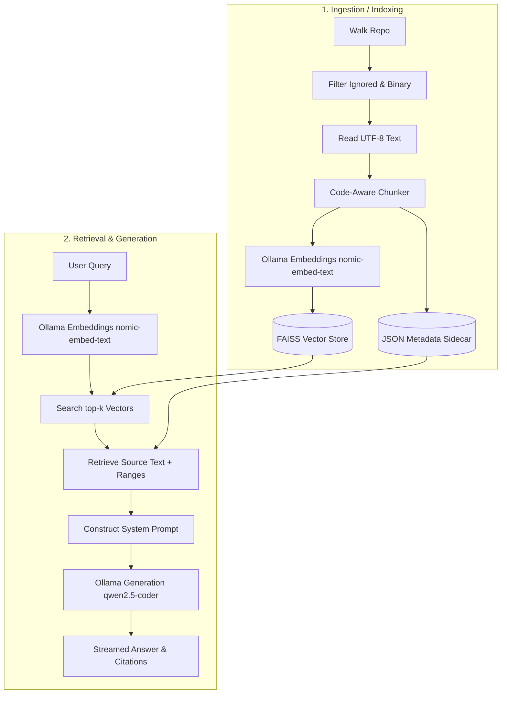

# RAG CLI

A local, open-source Retrieval-Augmented Generation (RAG) CLI tool that lets you ask natural-language questions about a codebase and get grounded answers with source citations.

Everything runs **locally** — no paid APIs, no cloud services. Powered by [Ollama](https://ollama.com/) for both embeddings and generation, and [FAISS](https://github.com/facebookresearch/faiss) for vector search.

---

## Architecture & How It Works

RAG CLI operates as a two-phase pipeline: **Ingestion (Indexing)** and **Retrieval & Generation (Querying)**.



### 1. Ingestion Pipeline
*   **Directory Walking (`rag/ingest.py`)**: Recursively lists files in the target repository. Employs aggressive ignore heuristics (skipping `.git`, `node_modules`, binary artifacts, and files > 1 MB) and inspects the first 8 KB of each file for null bytes to filter out binary payloads.
*   **Code-Aware Chunking (`rag/chunker.py`)**: Instead of dividing files strictly by token count, the chunker uses a sliding window (targeting ~300-500 tokens, estimate based on character density). To preserve semantic context in code:
    *   It looks for functional entry points (e.g. `def`, `class`, `function`, `fn`, `impl`) or blank lines using proximity heuristics.
    *   It splits before these logical boundaries rather than cutting mid-statement.
    *   It maintains a configurable overlap (~50 tokens) to preserve transition contexts.
*   **Embedding & Storage (`rag/store.py` & `rag/embeddings.py`)**: 
    *   Generates a 768-dimension vector for each chunk using Ollama's `nomic-embed-text` model.
    *   The vectors are L2-normalized and added to a FAISS `IndexFlatIP` (Inner Product, which represents cosine similarity for normalized vectors).
    *   A parallel metadata sidecar stores chunk source attributes (`file_path`, `start_line`, `end_line`, and `text`) mapping 1-to-1 with the FAISS vector indices.
    *   To keep indexing fast and idempotent, SHA-256 hashes of all files are tracked. Re-running `rag index` skips any unchanged files.

### 2. Query Pipeline
*   **Vector Search**: The user's query is vectorized via the same embedding model. FAISS retrieves the top $k$ chunks with the highest inner-product similarity scores.
*   **Prompt Construction (`rag/query.py`)**:
    The system compiles the retrieved chunks into a context block and feeds them to the LLM alongside the query. A strict system instruction prevents hallucination:
    > "Answer the user's question based ONLY on the provided source code context. If the context doesn't contain enough information, say so clearly."
*   **Streaming & Citation**: The answer is streamed back in real-time, accompanied by a concluding "Sources" block listing exact files, matching line ranges, and similarity scores.

### 3. Smart Model Selection (`rag/models.py`)
To make the tool hardware-agnostic, RAG CLI dynamically queries system specifications at runtime:
*   It checks physical RAM using OS parameters and queries NVIDIA VRAM via `nvidia-smi`.
*   It compares the maximum available memory resource against model requirements (Qwen2.5-Coder weights ranging from 0.5B up to 7B parameters) and selects the largest model your machine can safely execute.

---

## Setup

### Prerequisites
*   **Python 3.11+**
*   **Ollama** (Automatically configured in the custom step below, or installable via [ollama.com](https://ollama.com/))

### 1. Install RAG CLI
```bash
# Clone the repository
git clone git@github.com:Amrit-mishra07/RAGcli.git
cd RAGcli

# Set up a virtual environment
python3 -m venv .venv
source .venv/bin/activate

# Install package in editable mode
pip install -e .
```

### 2. Configure Local Ollama (Handling Low Disk Space)
If your `/home` partition is nearly full (e.g. less than 1-2 GB remaining), Ollama will fail to download models to `~/.ollama` by default. You can redirect storage to your root `/var/tmp` directory (which has more free space) using this script:

```bash
# 1. Download the standalone Ollama bundle to /var/tmp
curl -L https://ollama.com/download/ollama-linux-amd64.tar.zst -o /var/tmp/ollama-linux-amd64.tar.zst
mkdir -p /var/tmp/ollama_root
tar -xvf /var/tmp/ollama-linux-amd64.tar.zst -C /var/tmp/ollama_root
rm -f /var/tmp/ollama-linux-amd64.tar.zst

# 2. Start the daemon redirecting model downloads to root
nohup env OLLAMA_MODELS=/var/tmp/ollama_models /var/tmp/ollama_root/bin/ollama serve >/var/tmp/ollama_serve.log 2>&1 &

# 3. Pull the required models (Embedding + Light/Fast Generation variant)
env OLLAMA_MODELS=/var/tmp/ollama_models /var/tmp/ollama_root/bin/ollama pull nomic-embed-text
env OLLAMA_MODELS=/var/tmp/ollama_models /var/tmp/ollama_root/bin/ollama pull qwen2.5-coder:1.5b
```

---

## Usage

### Index a Repository
```bash
rag index /path/to/your/codebase
```
*Outputs are saved to `~/.rag_index/`.*

### Query the Codebase
```bash
rag ask "How is the cosine similarity calculated?"
```

Options:
*   `--k N` (Default: 5): The number of source chunks to retrieve.
    ```bash
    rag ask "Explain the walk_repo implementation details" --k 3
    ```

---

## v1 Next Steps (Planned Enhancements)
*   **Hybrid Search**: Combine dense FAISS vector embeddings with sparse BM25 keyword searches.
*   **Cross-Encoder Reranking**: Re-evaluate top-k vectors using a reranker model for higher contextual accuracy.
*   **AST Chunker**: Integrate `tree-sitter` to break chunks strictly along programming grammar (AST parse trees) instead of regex heuristics.
*   **Conversation Memory**: Support session states for follow-up conversational flows.

---

## License
MIT
